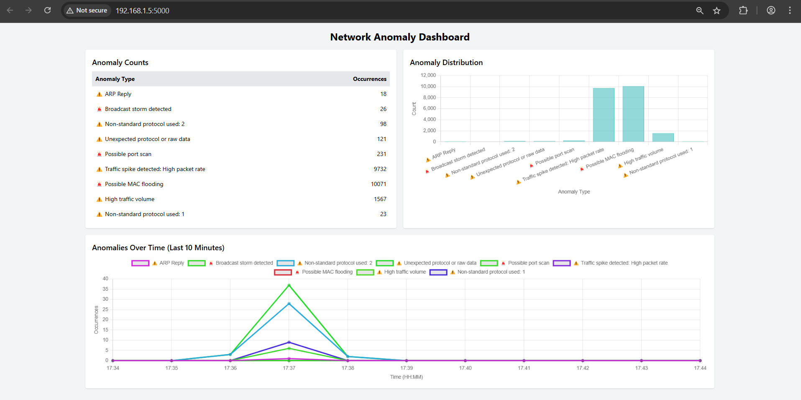

# Network Anomaly Detector

A lightweight, cross-platform network anomaly detection tool built with Python, designed to monitor network traffic, detect suspicious activities, and visualize anomalies in real-time. This project is ideal for cybersecurity enthusiasts, IoT device monitoring, and small-scale network security analysis.

## Features

- **Real-Time Packet Capture**: Captures network packets using Scapy, detecting anomalies like ARP spoofing, port scans, traffic spikes, DNS tunneling, and more.
- **Cross-Platform**: Runs seamlessly on Windows and Linux without code modifications, using dynamic interface selection.
- **Visual Dashboard**: Displays anomalies with counts and live-updating charts (bar and line) via a Flask-based web interface, with proper emoji rendering (⚠️, 🚨).
- **Live Updates**: Uses Flask-SocketIO to refresh the dashboard in real-time when new anomalies are detected.
- **Lightweight**: Optimized for IoT devices, with minimal dependencies and efficient resource usage.
- **Customizable**: Adjustable thresholds for anomaly detection (e.g., port scans, traffic spikes) to suit different network environments.
- **Logging**: Saves anomalies to `anomalies.log` for analysis and dashboard display.

## Screenshots


## Prerequisites

- **Python**: 3.6 or higher
- **Operating System**:
  - **Windows**: Npcap (for packet capture)
  - **Linux**: `libpcap` (for packet capture)
- **Dependencies**: Listed in `requirements.txt`
- **Permissions**:
  - Windows: Run as Administrator
  - Linux: Root privileges or `setcap` for packet capture

## Installation

### Windows

1. **Install Npcap**:

   - Download from npcap.com.
   - Install with **WinPcap API-compatible mode**.
   - Verify: `sc query npcap`.

2. **Set Up Virtual Environment**:

   ```cmd
   cd path\to\NetworkAnomalyDetection
   python -m venv venv
   venv\Scripts\activate
   ```

3. **Install Dependencies**:

   ```cmd
   pip install -r requirements.txt
   ```

### Linux

1. **Install System Dependencies**:

   ```bash
   sudo apt update
   sudo apt install python3 python3-pip libpcap-dev
   ```

2. **Set Up Virtual Environment**:

   ```bash
   cd /path/to/NetworkAnomalyDetection
   python3 -m venv venv
   source venv/bin/activate
   ```

3. **Install Dependencies**:

   ```bash
   pip install -r requirements.txt
   ```

4. **Grant Packet Capture Permissions** (optional, to avoid `sudo`):

   ```bash
   sudo setcap cap_net_raw,cap_net_admin=eip /path/to/NetworkAnomalyDetection/venv/bin/python3
   ```

## Usage

1. **Start Packet Capture**:

   - Windows (as Administrator):

     ```cmd
     venv\Scripts\activate
     python sniff.py
     ```

   - Linux:

     ```bash
     source venv/bin/activate
     python3 sniff.py
     ```

   - Auto-selects the network interface (e.g., `wlan0` on Linux, `\Device\NPF_{GUID}` on Windows). Override with `--iface`:

     ```bash
     python3 sniff.py --iface wlan0
     ```

2. **Generate Test Traffic**:

   - Use `arp_ping.py` to simulate ARP requests:

     ```bash
     python3 arp_ping.py
     ```

   - Simulate a port scan from another machine:

     ```bash
     nmap 192.168.1.5 -p 1-20
     ```

3. **View Dashboard**:

   - Start the dashboard:

     ```bash
     python3 dashboard.py
     ```

   - Open `http://127.0.0.1:5000` in a browser.

   - Features:

     - Table of anomaly types (e.g., "⚠️ ARP Reply", "🚨 Possible port scan") with counts.
     - Bar chart for anomaly distribution.
     - Line chart for anomalies over the last 10 minutes.
     - Live updates via WebSocket.

4. **Check Logs**:

   - Anomalies are logged to `anomalies.log`:

     ```bash
     cat anomalies.log
     ```

   - Example:

     ```
     [2025-04-22 22:30:00] ⚠️ ARP Reply from 192.168.1.1 with MAC 30:bd:13:06:c1:50
     [2025-04-22 22:30:05] 🚨 Possible port scan from 192.168.1.x: 20 ports targeted
     ```

## File Structure

```
NetworkAnomalyDetection/
├── sniff.py              # Captures packets and detects anomalies
├── detection.py          # Analyzes packets for anomalies (ARP, port scans, etc.)
├── arp_ping.py           # Generates ARP traffic for testing
├── dashboard.py          # Runs the Flask dashboard with live updates
├── templates/
│   └── dashboard.html    # HTML template for the dashboard
├── anomalies.log         # Log file for detected anomalies
├── requirements.txt      # Python dependencies
└── README.md             # This file
```

## Configuration

- **Thresholds** (`detection.py`):

  - Adjust anomaly detection sensitivity:

    ```python
    SPIKE_THRESHOLD = 2000        # Packets for traffic spike detection
    PORT_SCAN_THRESHOLD = 20      # Ports for port scan detection
    MAC_FLOOD_THRESHOLD = 2000    # Packets for MAC flooding
    ```

- **Dashboard Polling** (`dashboard.py`):

  - Modify WebSocket polling interval for IoT:

    ```python
    time.sleep(5)  # Check anomalies.log every 5 seconds
    ```

## Troubleshooting

- **ModuleNotFoundError: No module named 'scapy'**:
  - Ensure the virtual environment is active: `source venv/bin/activate`.
  - Verify Scapy: `pip show scapy`.
  - Run with venv’s Python: `/path/to/venv/bin/python3 sniff.py`.
- **No Anomalies Logged**:
  - Check interface: `python3 -c "from scapy.all import get_if_list; print(get_if_list())"`.
  - Ensure permissions: Use `sudo` or `setcap` on Linux.
- **Dashboard Issues**:
  - Verify `flask-socketio`: `pip show flask-socketio`.
  - Check browser console (F12) for JavaScript errors.
  - Ensure `anomalies.log` is writable.
- **Emojis Not Rendering**:
  - Confirm `dashboard.py` uses `clean_anomaly_type` for Unicode decoding.
  - Use a modern browser (e.g., Chrome).

## Contributing

Contributions are welcome! To contribute:

1. Fork the repository.
2. Create a feature branch: `git checkout -b feature-name`.
3. Commit changes: `git commit -m "Add feature"`.
4. Push to the branch: `git push origin feature-name`.
5. Open a pull request.

Please include tests and update documentation for new features.

## License

[](https://opensource.org/licenses/MIT)
[](https://www.python.org/downloads/)

This project is licensed under the MIT License. See the LICENSE file for details.

## Acknowledgments

- Built as part of a cybersecurity mini-project for network monitoring.
- Powered by Scapy, Flask, Flask-SocketIO, Chart.js, and Tailwind CSS.
- Thanks to the open-source community for inspiration and tools.